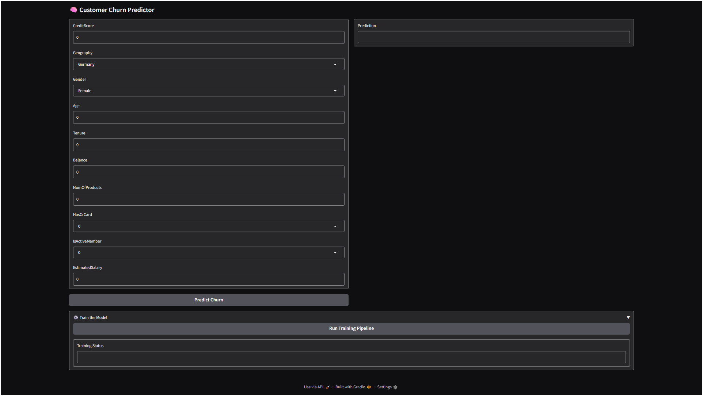

# Churn Modelling: A Production‑Grade Customer Churn Prediction Platform

An end‑to‑end, MLOps‑driven pipeline for automated customer churn prediction. By combining PyTorch‑powered neural networks, DVC versioning, MLflow experiment tracking, and an interactive Gradio interface, this system delivers accurate, traceable churn forecasts—ready for production.

---

## Here’s a preview of the app’s user interface:


---

## 📂 Repository Structure

```
.
├── .dvc/                          # DVC configuration & cache
├── .github/workflows/             # CI/CD pipelines
├── config/                        # Project-wide YAML config
├── ml-app/                        # Dockerfile & settings for Gradio app
├── mlflow-server/                 # Dockerfile & setup for MLflow server
├── notebook/                      # Exploratory data analysis notebooks
├── schema/                        # Saved schema definitions (YAML)
├── src/
│   └── churn_modelling/           # Package source
│       ├── configuration.py       # Config dataclasses
│       ├── pipeline/              # Ingestion, validation, transformation, training, prediction
│       ├── utils/                 # Model helpers, file I/O
│       ├── logger.py              # Logging setup
│       └── exception.py           # Custom exceptions
├── ETL.py                         # Orchestrates ingestion, DB & S3 push, schema save
├── ProjectConfig.json             # Basic project metadata
├── docker-compose.yml             # Multi‑service orchestration
├── dvc.yaml / dvc.lock            # Pipeline stage definitions & lock file
├── params.json                    # Pipeline hyperparameters
├── requirements.txt               # Python dependencies
└── setup.py                       # Package installer
```

---

## 🔧 Core Workflow

1. **Data Ingestion**
   Uses DVC to pull raw customer data (CSV) from remote storage, and runs `stage_01_data_ingestion.py` to persist cleaned datasets.

2. **Data Validation**
   Validates schema and missing values via `stage_02_data_validation.py`, ensuring data quality before transformation.

3. **Data Transformation**
   Encodes, scales, and engineers features in `stage_03_data_transformation.py`, outputting model‑ready training and test sets.

4. **Model Training**
   Trains and tunes a PyTorch + Skorch ANN through `stage_04_model_trainer.py`, logs metrics/artifacts to MLflow, and saves best weights.

5. **Real‑Time Gradio Interface**

   * **Training Trigger**: “Run Training Pipeline” button invokes the full DVC→MLflow pipeline.
   * **Churn Prediction**: Live inputs (customer age, balance, tenure, etc.) feed into the saved model via `predict_churn()`.
   * **Deployment**: Exposed at `http://localhost:7860` by default, with a clean, user‑friendly UI.

---

## ✅ Key Capabilities

* **Feature‑Grounded Predictions**
  Answers grounded in real customer features—credit score, geography, balance, usage patterns.
* **Full MLOps Stack**

  * **DVC** for data & artifact versioning
  * **MLflow** for experiment tracking & artifact storage in S3
  * **Structured Logs & Custom Exceptions** for robust pipeline observability
* **Interactive UI**
  Gradio app for non‑technical stakeholders to train models and predict churn in seconds.
* **Modular & Extensible**
  Clear separation of ingestion, validation, transformation, training, and inference; swap out model architectures or data sources with minimal changes.
* **Containerized Deployment**
  Dockerfiles for both the MLflow server and the Gradio app; orchestrated via Docker Compose for seamless local or cloud deployment.

---

## 🚀 Deployment & CI/CD

* **GitHub Actions**
  Automates DVC pulls, linting, testing, and Docker image builds on every commit (`.github/workflows/`).
* **Docker Compose**

  * **mlflow-server**: Builds from `mlflow-server/`, exposes port 5000, persists MLflow runs to a Docker volume.
  * **ml-app**: Builds from `ml-app/Dockerfile`, exposes port 7860, reads secrets from your `.env`, depends on `mlflow-server`.
* **Environment‑Driven Configuration**
  Store credentials and endpoints in a `.env` (referenced by `docker-compose.yml`):

  ```
  S3_BUCKET=""
  S3_BUCKET_OBJECT=""
  S3_BUCKET_PREDICTION_OBJECT=""
  S3_BUCKET_MLFLOW_DIR=""
  MLFLOW_S3_ENDPOINT_URL="https://s3.amazonaws.com"
  MLFLOW_TRACKING_URI="http://mlflow-server:5000"
  ```

---

## 🏃 Running Locally

1. **Clone & Enter**

   ```bash
   git clone https://github.com/hasan-raza-01/Churn-Modelling.git
   cd Churn-Modelling
   ```

2. **Install Dependencies**
  - ***Upgrade/Install pip and uv***
    ```bash
    pip install --upgrade pip uv
    ```
  - ***create virtual environment through uv***
    ```bash
    uv venv .venv --python 3.12
    ```
  - ***activate the environment***
    - ***Command Prompt / PowerShell***
      ```bash
      .venv\scripts\activate
      ```
    - ***Git Bash***
      ```
      source .venv/scripts/activate
      ```
  - ***Install required packages***
    ```
    uv pip install -e .
    ```

3. **Environment Variable MLFLOW_TRACKING_URI**
  - ***local machine*** 
  ```
  http://localhost:5000
  ```
  - ***dockerize/deployment*** 
  ```
  http://mlflow-server:5000
  ```

4. **env file path [env_file] in docker-compose.yml** 
  - ***local machine dockerization*** 
  ```
  .env
  ```
  - ***Aws Cloud deployment*** 
  ```
  /home/ubuntu/.env
  ```

5. **Run app**
   #### **Run ETL[Extract Transform Load] Pipeline**
   #### ***Note: Change variable named 'data_path' inside section [__name__ == "__main__"] of ETL.py with path/of/data/inside/your/local/system***
    ```
    uv run ETL.py
    ```
  - **Docker**
    - ***build and run images***
    ```bash
    docker-compose up --build
    ```

  - **Manuall**
    - **MLflow Server Launch**
      #### ***Before running the app, start the tracking server:***
      #### ***Note: change 'your-bucket' & 'path' from s3 bucket and path/of/.db/file respectively.***
      ```bash
      mlflow server \
        --backend-store-uri sqlite:///mlruns/mlflow.db \
        --default-artifact-root s3://<your-bucket>/<path>/ \
        --host 0.0.0.0 \
        --port 5000
      ```
    - **Run application**
      #### ***Note: On first run It will take time for creation of artifacts***
      ```
      uv run app.py
      ```

6. **Visit the UI**
   Open your browser to `http://localhost:7860` to train the model or predict churn in real time.
