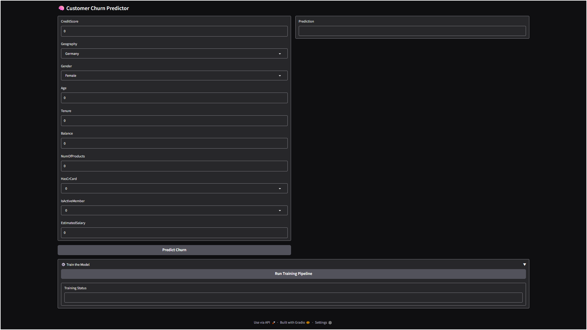
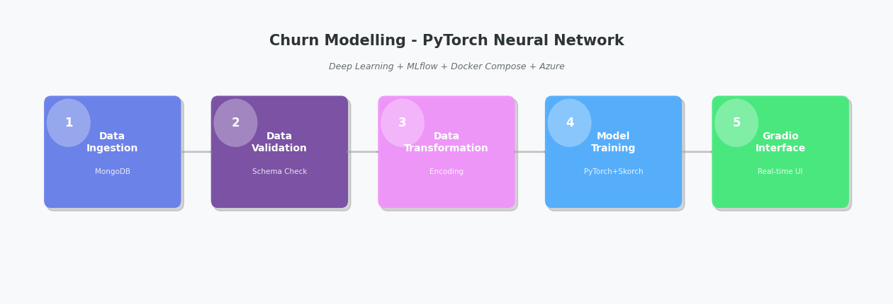

# Churn Modelling: A Production‑Grade Customer Churn Prediction Platform

An end‑to‑end, MLOps‑driven pipeline for automated customer churn prediction. By combining PyTorch‑powered neural networks, DVC versioning, MLflow experiment tracking, and an interactive Gradio interface, this system delivers accurate, traceable churn forecasts—ready for production.

---

## Here’s a preview of the app’s user interface:


---

## 📊 Project Workflow



*Complete end-to-end pipeline from data ingestion to deployment*

---

## 📂 Repository Structure

```
.
├── .github/
│   └── workflows/             # CI/CD pipeline workflows for automated deployment
├── config/
│   └── config.yaml            # Project configuration: artifact paths, model settings, MongoDB connection
├── notebook/                  # Jupyter notebooks for experimentation and prototyping
│   ├── data/
│   │   └── churn.csv          # Sample churn dataset for experiments
│   ├── EDA.ipynb              # Exploratory data analysis
│   ├── ETL.ipynb              # ETL process experimentation
│   ├── data_ingestion.ipynb   # Data ingestion prototyping
│   ├── data_transformation.ipynb # Data preprocessing and feature engineering
│   ├── data_validation.ipynb  # Data quality validation experiments
│   ├── model_evaluation.ipynb # Model evaluation with classification metrics
│   ├── model_trainer.ipynb    # Model training experimentation
│   └── trail.ipynb            # Experimental trials
├── schema/
│   └── schema.yaml            # Data schema definition for validation
├── src/
│   └── churn/                 # Main package source code
│       ├── __init__.py
│       ├── cloud/
│       │   └── __init__.py    # Cloud storage operations (S3)
│       ├── components/        # Core ML pipeline components
│       │   ├── __init__.py
│       │   ├── data_ingestion.py      # Fetches data from MongoDB and splits train/test sets
│       │   ├── data_transformation.py # Preprocesses data: encoding, scaling, feature engineering
│       │   ├── data_validation.py     # Validates data against schema and checks quality
│       │   ├── model_evaluation.py    # Evaluates model: accuracy, precision, recall, F1, ROC-AUC
│       │   └── model_trainer.py       # Trains classification model for churn prediction
│       ├── configuration/
│       │   └── __init__.py    # Configuration manager: reads config.yaml, MongoDB setup
│       ├── constants/
│       │   └── __init__.py    # Project constants: environment variables, collection names, paths
│       ├── entity/
│       │   └── __init__.py    # Dataclass entities: artifact and configuration objects
│       ├── exception/
│       │   └── __init__.py    # Custom exception handling with detailed error messages
│       ├── logger/
│       │   └── __init__.py    # Structured logging setup with timestamps
│       ├── pipeline/          # Orchestration layer for training and prediction pipelines
│       │   ├── __init__.py
│       │   ├── prediction_pipeline.py # Prediction pipeline: loads model and predicts churn
│       │   └── training_pipeline.py   # Training pipeline: orchestrates all 5 stages
│       └── utils/
│           └── __init__.py    # Utility functions: YAML I/O, model save/load, pickle operations
├── static/
│   └── style.css              # CSS styling for web interface
├── templates/
│   ├── form.html              # Input form for customer data
│   └── results.html           # Churn prediction results display
├── .dockerignore              # Excludes unnecessary files from Docker image build
├── .gitignore                 # Git exclusions: virtual environments, artifacts, credentials
├── Dockerfile                 # Container image for production deployment
├── ETL.py                     # ETL script: extracts churn data from source, loads to MongoDB
├── README.md                  # Project documentation and setup instructions
├── app.py                     # Flask application: /predict endpoint for churn prediction
├── main.py                    # Training pipeline orchestrator: runs all 5 stages sequentially
├── requirements.txt           # Python dependencies: scikit-learn, pandas, pymongo, Flask
└── setup.py                   # Package installer: configures package for pip installation
```

---

## 🔧 Core Workflow

1. **Data Ingestion**
   Uses DVC to pull raw customer data (CSV) from remote storage, and runs `stage_01_data_ingestion.py` to persist cleaned datasets.

2. **Data Validation**
   Validates schema and missing values via `stage_02_data_validation.py`, ensuring data quality before transformation.

3. **Data Transformation**
   Encodes, scales, and engineers features in `stage_03_data_transformation.py`, outputting model‑ready training and test sets.

4. **Model Training**
   Trains and tunes a PyTorch + Skorch ANN through `stage_04_model_trainer.py`, logs metrics/artifacts to MLflow, and saves best weights.

5. **Real‑Time Gradio Interface**

   * **Training Trigger**: “Run Training Pipeline” button invokes the full DVC→MLflow pipeline.
   * **Churn Prediction**: Live inputs (customer age, balance, tenure, etc.) feed into the saved model via `predict_churn()`.
   * **Deployment**: Exposed at `http://localhost:7860` by default, with a clean, user‑friendly UI.

---

## ✅ Key Capabilities

* **Feature‑Grounded Predictions**
  Answers grounded in real customer features—credit score, geography, balance, usage patterns.
* **Full MLOps Stack**

  * **DVC** for data & artifact versioning
  * **MLflow** for experiment tracking & artifact storage in S3
  * **Structured Logs & Custom Exceptions** for robust pipeline observability
* **Interactive UI**
  Gradio app for non‑technical stakeholders to train models and predict churn in seconds.
* **Modular & Extensible**
  Clear separation of ingestion, validation, transformation, training, and inference; swap out model architectures or data sources with minimal changes.
* **Containerized Deployment**
  Dockerfiles for both the MLflow server and the Gradio app; orchestrated via Docker Compose for seamless local or cloud deployment.

---

## 🚀 Deployment & CI/CD

* **GitHub Actions**
  Automates DVC pulls, linting, testing, and Docker image builds on every commit (`.github/workflows/`).
* **Azure Container Registry (ACR)**
  * Pushes built Docker images (mlflow-server and ml-app) to your Azure Container Registry.
  * Uses azure/login, azure/docker-login, and azure/cli GitHub Action steps to authenticate and push images.
  * Tags images with commit SHA and latest for traceability.
* **Azure Virtual Machine**
  * After images are in ACR, a final workflow step uses az vm extension or ssh-action to pull the latest images on an Azure VM (Ubuntu) and restart the containers.
  * Exposes ports 5000 (MLflow) and 7860 (Gradio) via Azure NSG rules.
  * Environment variables and secrets (ACR credentials, S3 endpoints, etc.) are injected via VM-managed identities or a .env on the VM.
* **Docker Compose**

  * **mlflow-server**: Builds from `mlflow-server/`, exposes port 5000, persists MLflow runs to a Docker volume.
  * **ml-app**: Builds from `ml-app/Dockerfile`, exposes port 7860, reads secrets from your `.env`, depends on `mlflow-server`.
* **Environment‑Driven Configuration**
  Store credentials and endpoints in a `.env` (referenced by `docker-compose.yml`):

  ```
  # All are Optional
  S3_BUCKET=your_s3_bucket_name
  S3_BUCKET_OBJECT=your_s3_bucket_object[sqlite file storage object]
  S3_BUCKET_DVC_STORE_OBJECT=your_s3_bucket_object_for_dvc_store[dvc store object]
  S3_BUCKET_PREDICTION_OBJECT=your_s3_bucket_object[predictions storage]
  S3_BUCKET_MLFLOW_DIR=your_s3_bucket_objet[to store mlflow experiments]
  MLFLOW_S3_ENDPOINT_URL="https://s3.amazonaws.com"
  ```
  **GitHub Secrets Action**
  ```
  ACR_USERNAME=your_azure_container_registory_admin_username
  ACR_PASSWORD=your_azure_container_registory_admin_password
  AZURE_VM_HOST=your_azure_Virtual_Machine_Publi_Port
  AZURE_VM_USER=your_azure_Virtual_Machine_username{default:azureuser}
  SSH_PRIVATE_KEY=your_azure_ssh_key_for_vm
  ```
---

## 🏃 Running Locally

1. **Clone the repo and enter the folder**

   ```bash
   git clone https://github.com/hasan-raza-01/Churn-Modelling.git
   cd Churn-Modelling
   ```

2. **Install Dependencies**
  - **Install package manager uv by astral**
    - Official documentation: https://docs.astral.sh/uv/getting-started/installation/

  - **create virtual environment with dependencies**
    ```bash
    uv sync
    ```
  - **activate the environment**
    - *windows*
      ```bash
      .venv\scripts\activate
      ```
    - *linux*
      ```bash
      source .venv/bin/activate
      ```

3. **Run app**
  * **Mannual**
    - *Run ETL[Extract Transform Load] Pipeline*
    ```bash
    uv run ETL.py
    ```
    
    - *Run core application* 
    ```bash
    uv run app.py
    ```
    
    - *Run mlflow server*
    ```bash 
    mlflow server \
    --backend-store-uri sqlite:///mlflow.db \
    --default-artifact-root mlruns/ \
    --host 0.0.0.0 \
    --port 5000
    ```

  * **Docker**

    - *build images*
    ```bash
    docker-compose build --no-cache
    ```

    - *run images*
    ```bash 
    docker-compose up
    ```
4. **Navigation Url's to interact with servers**
  - core application: http://127.0.0.1:7860
  - mlflow server: http://127.0.0.1:5000

---
